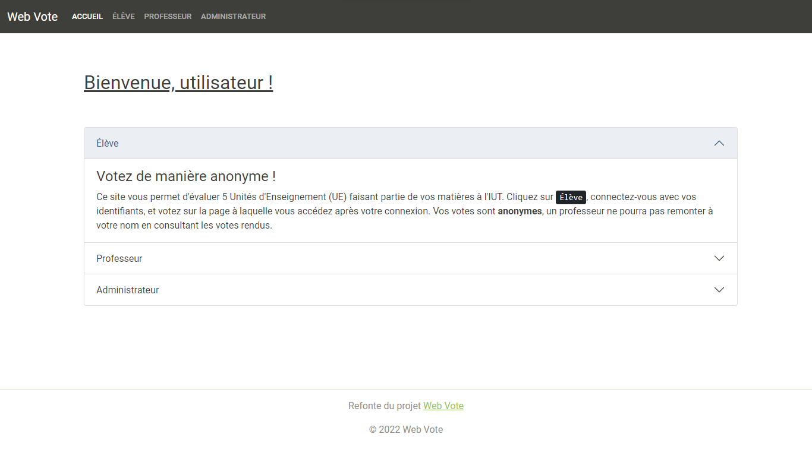
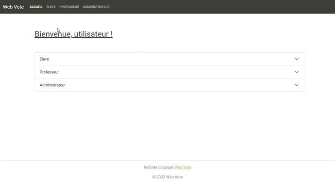

# Web Vote - Refonte

Ce projet est la refonte d'un projet datant de mon 2018 ([Web Vote](https://github.com/Mar-Nb/web-vote)), réalisé en PHP 5, sans aucun framework CSS.

Le but de ce projet était de réaliser une plateforme web de vote pour des élèves, à propos des cours des professeurs de leur établissement. Les professeurs devaient pouvoir consulter les votes de leur matière, et un administrateur de la plateforme avait accès à un export PDF des résultats des votes sur la plateforme. Chacun de ces types d'utilisateurs pouvait se connecter via un simple formulaire de connexion.

Ici, le projet initial est quelque peu actualisé : passage de PHP 5 à PHP 7, utilisation du framework CSS **Bootstrap** et le stockage des votes se fait maintenant via **SQLite**.
## Auteurs

- [@Mar-Nb](https://github.com/Mar-Nb)

## Capture d'écran

## Technologies utilisées

Plusieurs technologies sont à l'oeuvre dans cette refonte de projet :

* PHP 7
* [Bootstrap 5](https://getbootstrap.com/)
* SQLite
* Javascript
* AJAX
* [FPDF](http://www.fpdf.org)
* [Chart.js](https://www.chartjs.org/docs/latest/)

## Fonctionnalités

* Formulaire de connexion
* Affichage de graphique
* Export PDF
* Export de graphique
* Requête SQL asynchrone
* Toast informatif
* Création et suppression d'utilisateur

## Roadmap

* [x]  Page d'accueil
* [x]  Mise en place de la base de données SQLite
* [x]  Formulaire de connexion
* [x]  Différents utilisateurs
    * Elève
        * [x]  Formulaire de vote
        * [x]  Toast d'état de vote
    * Professeur
        * [x]  Graphique des votes
    * Administrateur
        * [x]  Récapitulatif des notes des professeurs
        * [x]  Graphique des notes des professeurs
        * [x]  Export PDF du récapitulatif
        * [x]  Export des graphiques
## Démo

Il est possible de tester la plateforme Web à l'adresse suivante : https://nb-dev.fr/web-vote-refonte/.

Trois comptes pour tester :

* Elève
    * Identifiant : **e1001**
    * Mot de passe : azer
* Professeur
    * Identifiant : **prof1**
    * Mot de passe : p001
* Administrateur
    * Identifiant : **admin**
    * Mot de passe : admin

